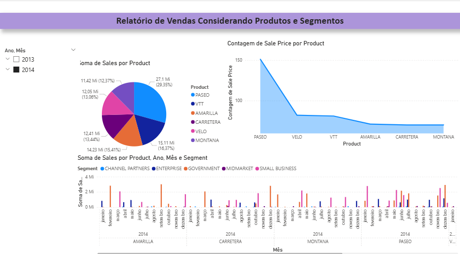

# Dashboard de Análise Financeira - Power BI

Este projeto apresenta visuais criados a partir do conjunto de dados **Financial Sample**. 

## Visuais criados

### Visual Mapa 1 - **Descrição:** Soma de *Sales* e *Unidades Vendidas* por país.
- **Objetivo:** Identificar os países com maior volume de vendas e unidades comercializadas.

 

  
### Visual Mapa 2 - **Descrição:** Soma de *Profit* (Lucro) por país.
- **Objetivo:** Avaliar a lucratividade por região geográfica.
  
 

### Visual de Pizza - **Descrição:** Lucro por segmento. 
- **Objetivo:** Comparar a participação de cada segmento no lucro total. 

### --- Como abrir 1. Baixe o arquivo `.pbix` deste repositório. 2. Abra no **Power BI Desktop**. 3. Explore os visuais e interaja com os filtros disponíveis. --- 

## Tecnologias utilizadas 
- Power BI Desktop
- Dataset: Financial Sample
